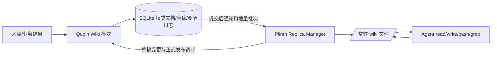

# LLM Wiki 核心设计：事务式文档权威 + 常驻文件副本

- 日期：2026-09-30；状态：**设计稿，尚未实施**。
- 完整实施规格：[Issue #111](https://github.com/Suknna/quoin/issues/111)。后端由当前 Agent 负责，前端由用户另行指定模型；接口契约先行，双方完成联合验收后才关闭 Issue。
- 会话交接时以 Issue #111 和本文最终 SQLite 方案为准；研究目录内的 Git/文件同步候选仅为选型记录，不恢复为实施要求。
- 本版依据用户最新允许“Quoin 权威可用文档数据库”和“当前一个 Plinth”，**选择以现有 SQLite 文档版本存储替换前稿 Git 权威方案**。
- 代码调查基线：`main@105e828`；不执行迁移、清库或初始化。
- 研究：[模式与一手资料](research/llm-wiki-primary-sources-20260930.md)、[选型对比](research/wiki-storage-alternatives-20260930.md)、[当前文件工具](research/quoin-workspace-tools-20260930.md)。
- 运行协议：[常驻 /wiki 副本一致性](llm-wiki-replica-consistency.md)。

## 1. 已确认要求和本版选择

用户已确认：

1. Wiki 是 Quoin 核心能力，不是插件；替换 embedding/cosine 知识检索主链路。
2. 人和模型平等增删改查、自动整理发布，不需要人工审批。
3. 有版本、差异、作者、操作记录与删除恢复；“类似 Git”是体验要求。
4. 不双存权威正文；**现在允许 Quoin 将正文存在数据库，Plinth 以 .md 文件呈现副本**。
5. Plinth 当前一个 Pod，生命周期内始终有一份 `/wiki/`，任务复用，不按任务复制；Pod 重建从 Quoin 恢复。
6. Agent 复用标准 read/write/bash/grep；不新增一套平行 Wiki 文件工具。
7. 共享副本读并行、写独占；编辑后须在 Quoin 保存草稿再确认成功。
8. 巡检/日报进入 Wiki，支持准确、有出处的历史分析。
9. 按新系统设计，不做旧知识结构兼容或历史迁移。

**本版推荐并采用：Quoin 现有 SQLite 保存 Markdown、不可变修订、草稿与变更批次；Plinth 把正式版本投影为常驻文件。** 不引入新的 CouchDB/MongoDB 服务，也不把数据库文件复制到 Plinth。

这仍是 LLM Wiki：模型维护可阅读、互链、可持续演进的 Markdown；存储引擎不决定它是不是 Wiki。取消向量化不等于取消检索，程序与 Agent 可以使用目录、标题、别名、文本和来源链接。

## 2. 为什么替换 Git

当前 Quoin 本来就有：

- `knowledge_versions` 的不可变正文与修订机制，以及知识来源/反馈失效处理。
- 执行命令账本、身份校验、审计、任务围栏与只读查询池。
- SQLite WAL 与 `synchronous(FULL)` 配置及核验（`internal/quoin/bootstrap/database.go:74,229,314`）。

Git 方案会在这些能力之外再引入对象库、引用更新、工作区一致性、草稿 refs，以及 **Git 已提交但运行数据库未封存** 的恢复窗口。对一个 Quoin 权威和一个 Plinth 缓存，这些复杂性没有带来必须依赖 Git 的用户能力。

| 需求 | 本版实现 | 相比 Git 的实际收益 |
|---|---|---|
| 多页修改一起生效 | 一次数据库事务 | 正文、当前指针、审计与同步批次一起提交 |
| 每轮编辑可靠保存 | 草稿修订 + 幂等账本，同事务确认 | 无需额外 Git ref 持久性/多资源裁决 |
| 人与 Agent 并发修改 | 文档级 expected revision + 依赖校验 | 可区分真正冲突与无关文档变化 |
| 历史、删除恢复、差异 | 不可变修订 + 追加恢复操作 | 复用已有领域版本机制，不重造完整 Git |
| 副本追赶 | 有序 changes feed + 游标/快照 | 与应用权限、任务围栏天然统一 |
| 备份恢复 | 复用 Quoin 数据库备份/校验 | 不再协调 Git 和运行库两个权威备份 |

SQLite 仍是单个写事务串行化，不是无限并发写数据库；本方案让写事务短小，**绝不在事务内等待 LLM 或网络**。真正的共享目录限制仍需本地读写协调，不因换数据库消失。

### 替代方案的适用边界

- **CouchDB**：原生文档复制有价值，但当前 Plinth 是普通文件副本，仍需映射层；冲突修订不会自动成为语义正确的合并，跨页原子发布与长期业务历史也不能直接等同于原生复制。引入独立数据库的收益目前不足。
- **Syncthing**：擅长文件运输与冲突文件保留，不能替代 Quoin 的任务围栏、草稿确认和多页发布事务；源文件与运行库分离的问题仍在。
- **Automerge/Yjs**：适合真正的实时协同数据结构；要把 read/write/bash 的整文件改写转换为正确的增量操作，仍需适配。当前单 Plinth、单 Wiki 写者没有足够理由引入这套权威状态。
- **Git**：若未来重新要求普通文件/Git 工作区必须是 Quoin 权威、需要直接 git clone/push 协作，再重新评估；这已不是本轮硬约束。

选型证据和限制详见[对比研究](research/wiki-storage-alternatives-20260930.md)。以上是当前规模与既有实现下的选择，不是断言某种数据库在所有模式都优于 Git。

## 3. 唯一权威与文件位置

```text
Quoin（持久 PVC）
  ${dataDirectory}/quoin.db（现有 SQLite 业务库）
    Wiki 文档正文及不可变版本
    正式变更批次、删除记录、来源关系
    模型草稿、操作幂等、审计、任务状态

Plinth（Pod emptyDir）
  /wiki/
    index.md
    systems/...
    runbooks/...
    incidents/...
    reports/inspection/...
    reports/daily/...
    catalog/...
```

**Quoin 不再同时维护一棵权威 `.md` 工作树，也不创建 `.git`。** Markdown 内容在数据库中是文本，在 Plinth 中是实际文件；后者是明确可重建的缓存，不是第二个可独立裁决的知识库。

用户若需要文件包，可从指定 Wiki 修订导出 Markdown/YAML；导出不是在线双写或反向覆盖通道。原始附件等非 Wiki 正文继续引用现有 Source Material/Artifact，不为 Wiki 复制全部遥测数据。

## 4. 模块和数据模型

沿用 `internal/quoin/knowledge` 作为核心深模块。网页、业务任务和副本管理器复用同一 Interface；模型继续使用普通文件工具。

| 逻辑对象 | 职责 |
|---|---|
| Document | 稳定 docId、逻辑路径、当前正式 revisionId、可见范围或墓碑 |
| DocumentRevision | 不可变正文、metadata、来源引用、正文 hash；可被草稿或正式批次引用 |
| ChangeSet | 一个跨页原子提交；作者、理由、操作 ID、时间与单调 publishedSeq |
| ChangeItem | 批次中的新增/修改/改名/删除/恢复，绑定旧新 revisionId |
| EditSession / Draft | 编辑基准、实际读依赖、最新 draftSequence、草稿修订引用与任务围栏 |
| SourceRevision / Dependency | 原始来源版本和支持关系；与纯导航链接区分 |

这些是逻辑命名。实现时复用/重构现有不可变知识版本、来源、命令/审计等能力；不另外实现 Git 的 pack、branch、rebase、checkout 或对象 GC。

正文只有一个权威修订记录。草稿发布可以直接让正式 ChangeSet 引用已保存修订，而不是复制一次正文；变化事件只保存定位/类型/hash，不保存第二份全文。

建议程序 Interface：

```text
Snapshot(scope)                    -> snapshotSeq, manifest, revision references
Changes(afterSeq, scope, cursor)    -> complete change batches
GetRevision(revisionId)             -> immutable Markdown/structured content
SaveDraft(editId, sequence, changes)-> durable draft receipt
Publish(editId, expectedVersions)   -> changeSetId, publishedSeq
History(documentId)                -> revisions, changes, deletion/restoration
```

表名、wire shape 与字段上限属于后续实现契约；本文不声称这些接口已经存在。

## 5. 写入、并发与版本历史

### 5.1 草稿确认

监督程序在一轮有效 Wiki 文件操作结束后回传变更。Quoin 在一个事务中：

1. 检查当前运行身份、任务有效性、可写范围与来源资格。
2. 根据操作 ID/draftSequence/digest 判断重试、序号倒退或同键异请求。
3. 保存新 DocumentRevision，推进 EditSession 草稿指针，封存相应工具结果/审计定位。
4. COMMIT 成功后才发送“草稿已保存”确认。

草稿不进入正式目录/检索，也不触发新资料循环。它是恢复机制，不是审批队列。

### 5.2 正式发布

同一个数据库事务内校验并执行：

- 修改/删除目标的 expectedRevision 与当前版本一致；新建/改名满足路径唯一性。
- 模型实际依赖的资料没有发生要求重读的变化；来源未被撤回，权限和任务围栏有效。
- 原子更新全部文档当前指针/墓碑，追加 ChangeSet 与 ChangeItems，推进 publishedSeq。
- 同事务写入审计、幂等结果、必要来源资格/目录投影、维护任务与本次任务的权威结果定位。

推理、文件传输和 Markdown 解析等耗时工作先在事务外完成，事务内只做最终复核和权威写入。

两个编辑者修改无关文档不必仅因全库序号变化而冲突。若写同一旧版本、路径冲突或依赖已变化，则返回明确冲突，保留草稿；模型在更新的副本上重新整理，不覆盖他人、不要求人逐次审批。

标准 shell 的文件读取集合不能天然精确追踪。read/grep 可以由执行器提供实际文件/version 记录；无法确认的 bash 依赖采用保守的任务范围版本校验，不能编造“精确知道模型读过哪些页”。

### 5.3 删除与恢复

- 删除是发布墓碑，退出当前索引/文件投影；正文旧版本仍在。
- 恢复是新的 ChangeSet，引用旧正文或新修订，不倒退全局版本或覆盖之后的其他编辑。
- 来源已经撤回时，恢复正文不自动恢复其有效性。
- 普通自动摄入识别墓碑，不能无意复活被删页；显式恢复记录目的与目标版本。
- 人与模型使用同一规则。作者与时间来自真实 Session/Attempt，不相信文档里的自填 author。

## 6. 常驻副本怎样同步

采用 **事务性变更日志 + 通知 + 游标拉取 + 快照恢复**，而非数据库文件复制、持续双向目录覆盖或另一个权威数据库。



同步发生在 Pod 初次启动、权威版本变化、断线重连与低频兜底核对时；**不在每个任务开始时复制 Wiki**。

1. 初次从一致的数据库视图读取 manifest，绑定不可变 revisionId；后续逐页读正文也不能回头读取 current 混版。
2. 平时按 appliedSeq 拉取之后的完整 ChangeSet；通知丢失也能靠游标补齐。
3. 文件更新取得本地独占锁，整批应用并核验，再推进 appliedSeq；不能应用一半就声明新版本。
4. 草稿与正式内容的回传走命令 Interface，不直接覆盖目录，也不允许 Plinth 自行伪造发布序号。
5. 日志游标失效/缓存损坏/Pod 重建时重新取正式快照，再恢复 Quoin 已确认的草稿。

SQLite WAL 是权威库的本机读写机制，**不是拿 WAL 文件向 Plinth 做跨节点复制**。

## 7. 共享 /wiki 的读写规则

用户已确认“读并行、写独占”，本版保持：

- 多个只读任务可以共同使用同一正式文件版本，租约覆盖需要稳定 Wiki 的整个任务/回合。
- Wiki 编辑任务独占目录；其他 Wiki 任务和文件刷新等待。独占包括模型推理与草稿保存，不只是最后提交的时间。
- 副本锁不锁住 Quoin 数据库或网页的人类编辑；远端写冲突在正式发布时裁决。
- 读任务需要编辑时，释放读租约，再调度/进入新的编辑任务，避免升级锁死锁。
- 有等待的编辑/同步时控制新读者准入，避免写方饥饿。
- 崩溃后先停止仍能写目录的子进程、核对草稿、整理干净，才能放行新读者。

这是单棵共享可写目录的约束，与后端选择 Git、SQLite、CouchDB 或 CRDT 无关。

## 8. Agent 实际使用方式

worker 的知识工作目录为 `/wiki`，不是 `workspace/attempt-123/wiki`。程序给一个短入口：

```text
Wiki 入口：index.md
使用版本：publishedSeq=<N>；本次业务范围：payment-prod
建议流程：runbooks/db-pool.md
历史报告目录：catalog/reports/
先找相关页，再读正文和来源；比较历史时核对窗口、单位、模板和缺口。
```

模型复用现有调用：

```text
read(path="index.md")
bash(command="rg -n '连接池|connection pool' runbooks incidents")
read(path="runbooks/db-pool.md")
write(path="notes/pool-observation.md", content="...")
```

当前 grep 为单文件搜索，跨文件先用已有 bash/rg；read 应支持范围续读或使用 bash/sed 分段。这些是通用工具契约的完善，不需要为 Wiki 再造平行的文件工具。

已核验当前依赖 Eino v0.9.13 自带 filesystem `edit_file` 工具及 `Backend.Edit` 契约，本项目尚未接入。因此建议补齐通用 edit：优先复用框架现成能力，适配 worker 的受限磁盘后端、冻结工具目录和草稿确认，而非从零实现 Wiki 专用编辑器。局部更新使用精确替换，新建/完整重写使用 write；在此之前仍能通过完整 read→write 或 bash/sed 改文档。参见[工具核对第 7 节](research/quoin-workspace-tools-20260930.md)。

| 场景 | 程序引导 | 模型与维护 |
|---|---|---|
| 定时巡检/日报 | 本次事实、检查口径、同范围历史报告入口 | 共享读并分析；报告结果由核心存为文档；可复用新认识交给编辑任务 |
| 对话 | 本轮问题、可见范围与相关路径 | 自主搜索；需要改知识时进入编辑模式，普通聊天不逐句沉淀 |
| 告警分析 | 告警/资源/视图事实、流程与历史案例入口 | 核实知识是否适用，结合本次 Evidence；有依据的修订进入编辑任务 |
| Wiki 维护 | 来源变化/过期/冲突等明确原因与范围 | 同样用四个文件工具整理、合并、删除，程序保存草稿并自动发布 |

副本有完整内容不意味着整库进入 prompt。先目录、后正文，模型按需读；使用范围和未搜索部分必须明确。文件的稳定身份与 revisionId 由 supervisor manifest 绑定，真正被模型消费的版本才算引用；自己的新总结不能自证正确。

## 9. 巡检报告与历史分析

报告在 Quoin 中是受版本管理的文档集合，在 `/wiki` 中展开为：

```text
reports/daily/2026/09/30/<report-id>/
  manifest.yaml       时间窗口、范围、截止、模板/参数/单位
  facts.json          检查事实、缺口、观测时间与 Evidence 引用
  analysis.md         解释、历史比较、假设与建议
```

事实与解释是不同内容，不是同一正文双存。报告事实先封存；模型不可用时事实仍在。分析可独立形成新版本；当时版本、更正、最新说明分别可查看。

历史比较：

1. 按业务范围、目标、模板和日期选历史，不把所有报告全文塞进上下文。
2. 程序检查单位、表达式/参数、统计窗口、目标范围、时区/DST与缺采证是否可比。
3. 有明确算法的数值变化、次数、缺口率由程序计算，绑定输入版本；未知结构化结果不凭字段名乱算。
4. 模型解释趋势、复发和已验证处置，分别注明本次事实、历史事实、假设和建议。

历史无数据不是 0，旧建议不是已执行成功，模型曾经说过不是独立证据。观测时间与发表/更正时间分开，重现当时分析不能混入未来资料。已确认的日报自然日窗口、两小时截止与迟到事实不回填规则保持。

## 10. 自动整理与知识腐烂

`wiki_maintenance` 是一类独立运行的任务，复用现有 Plinth 和模型，不是新增常驻 Agent 服务。

| 触发 | 行为 |
|---|---|
| 新/更新资料 | 对受影响主题编纂；同源同版本去重 |
| 报告完成 | 报告直接可查，维护任务整理其中的新认识与关联页 |
| 告警分析完成/后续反馈 | 保存有来源的案例；VerifiedEffective/Rejected 触发相应修订 |
| 对话或人工编辑 | 有跨页影响再整理，不为普通聊天或标点变化开任务 |
| 周期 lint | 建议每日低优先级检查过期、矛盾、断链、孤页和未处理资料，不重写全库 |
| 用户要求整理 | 直接派指定范围编辑任务，自动发布，无审批 |

程序即时处理来源撤回、权限变更和检索资格；模型异步修订文案。文件已经被读到无法物理收回，相关正在运行任务需在模型调用/最终结果围栏被中断或要求重建。

区分编辑时间、核查时间、独立证据支持时间。旧历史事件不会仅因年龄变假；今天重新改写旧结论也不会变成新证据。矛盾应保留双方依据和 conflict 状态，不靠最近作者或“模型自信度”消除。

Wiki 输出不再次被当作独立原始来源；索引更新不触发又一轮编纂；任务按来源/原因/范围/策略代次去重，no-op 不制造版本风暴。

## 11. 用户体验和权限

栏目：Wiki 主题、巡检/日报、原始材料、最近变更、维护状态、回收站。移除“待确认”发布栏目。

- 阅读页展示 Markdown、适用范围、来源、最近独立支持时间与版本。
- 变更页展示作者/模型、任务、理由、跨页 diff 和恢复；保留类似 Git 的体验但不再声称底层 Git 提交。
- 编辑直接发布；后台有更新时保留人的草稿，冲突明确呈现。
- 报告提供本期事实、AI 解读、历史对比与版本引用，明确不可比项/缺口。
- 模型动作按一次维护任务汇总通知，用户知晓并可恢复，不需点批准。

一份物理副本不等于所有 worker 可读所有数据。复用既有角色/范围，继承来源权限；沙箱按目录/文件给读写能力，不能仅保护工具名。模型不得改 supervisor 同步状态、伪造身份或把可编辑 Wiki 当作系统提示词。

## 12. 故障、备份和实施边界

- 草稿保存成功后 Pod 丢失，可从 Quoin 恢复；未确认的最后一轮不承诺无损。
- SQLite 事务成功但确认丢失，命令账本返回同一结果；不重复版本。
- 同步应用一半崩溃，副本先校验/重建，不对外声称完整版本。
- 备份包含权威版本、草稿、变化日志、任务与来源；复用现有 Quoin 备份/校验。恢复旧备份要更换同步 epoch，避免缓存把重复使用的序号当成同一历史。
- 不开放离线多主写：Plinth 本地文件变化不能在未获 Quoin 确认时说已保存。

现有原始 Source Material、Evidence、Artifact 的正文仍由其领域持有，Wiki 引用它们；删除引用页不自动物理删除原材料。必要来源要有可核实的版本/保留策略，不能只留一个未来失效的 URL。

## 13. 实施顺序与验收

1. 重构知识域为版本化 Markdown，保留来源/不可变版本思想，移除人工确认与 embedding 主链路。
2. 完成草稿事务、跨页发布、文档并发校验、恢复、命令幂等和变更 feed。
3. 完成常驻 `/wiki` 引导/增量、读写协调、逐轮草稿确认与 Pod 恢复。
4. 接入标准文件工具、模型输入引用与报告历史比较。
5. 自动维护、页面 diff/回收站、备份恢复与故障验证。

关键验收：同页竞争不丢写、无关文档可以并发成功、多页发布全成或全不成、重试不重复、草稿确认后 Pod 消失可恢复、同步通知丢失可追赶、任务不混文件版本、无向量/无模型仍可浏览编辑、来源撤回立即改变资格、历史报告引用准确。

未来如果真的出现多个 Quoin 写节点、大量实时协同编辑或离线多主需求，再以证据重新评估数据库/CRDT；本次不提前搭建这些基础设施。
